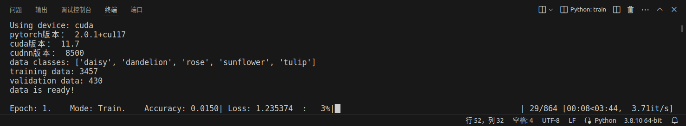
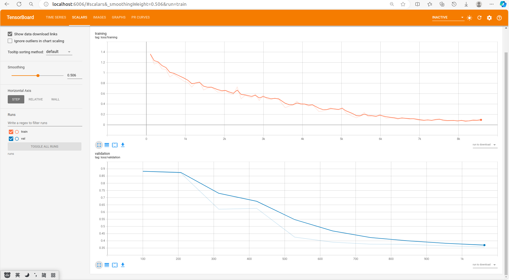
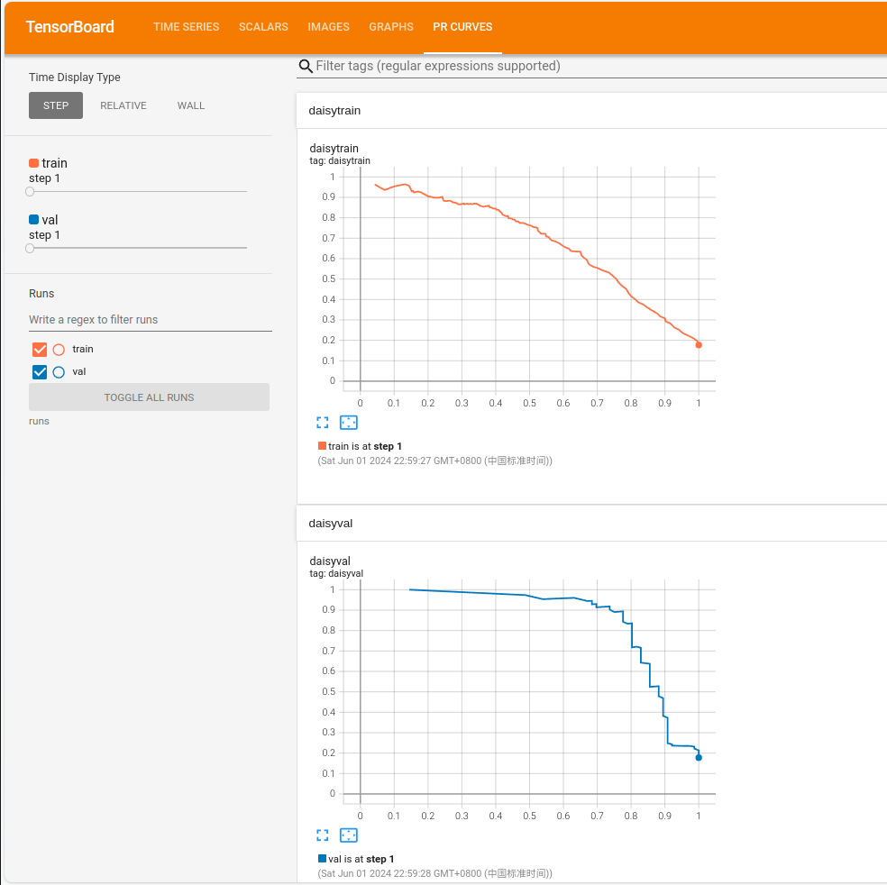
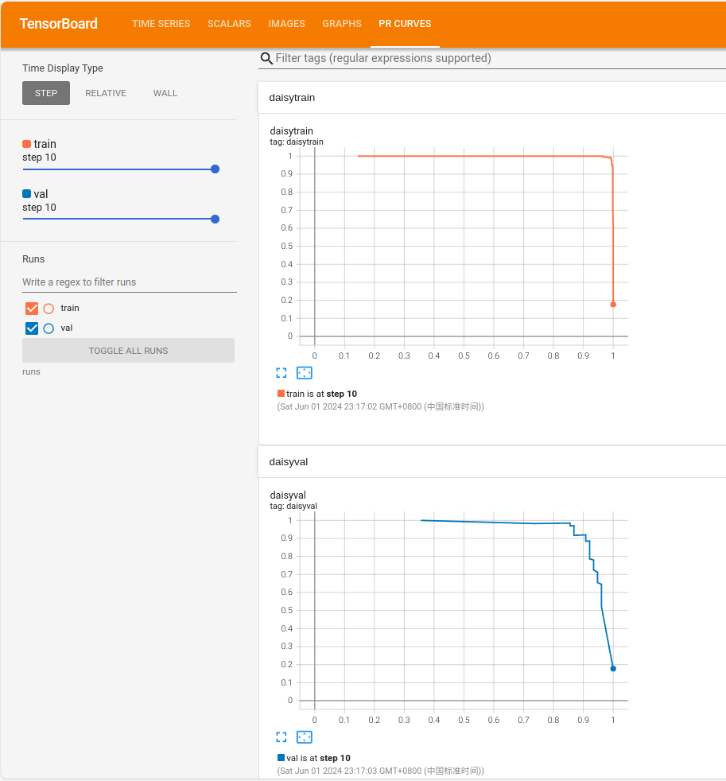
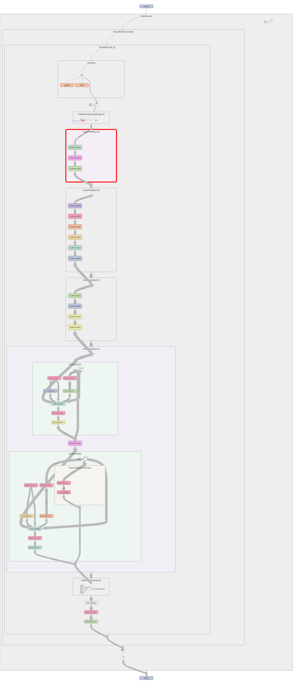
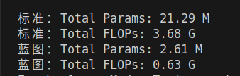
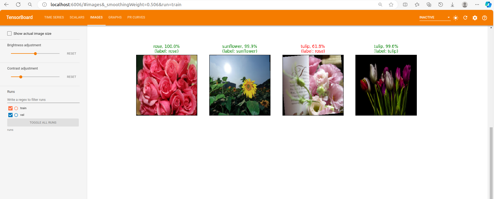
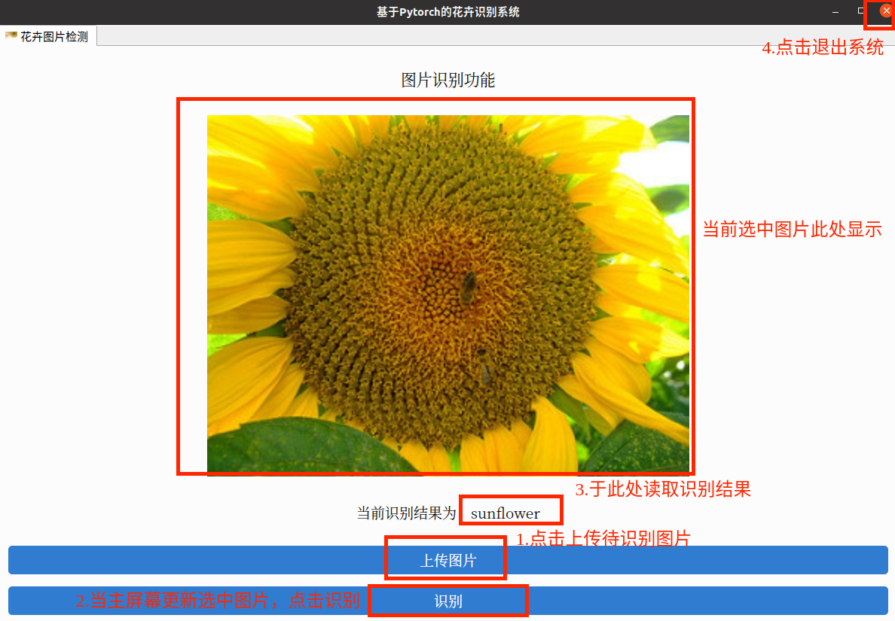

## 基于蓝图可分离卷积的轻量化花卉识别系统——设计报告

作者：电子与信息学院 | 2022级信息工程 | 1班于浩林 2班王承志

### 1. 引言

本项目旨在开发一个高效、准确的轻量化花卉识别系统。系统基于 PyTorch 深度学习框架，采用预训练的 ResNet-34 模型作为基础，并通过引入蓝图可分离卷积（BSConv）技术实现模型的轻量化。系统不仅能够完成特定花卉的分类任务，还提供了一个可定制的框架，适用于更广泛的图像分类应用。此外，系统集成了训练过程的可视化以及用户友好的图形界面（GUI），方便用户进行模型训练、评估和实际应用。

#### 先决条件

为保证最佳兼容性和性能，在运行代码之前，您需要安装以下先决条件：

- **Linux 操作系统** - 本系统全程基于 Linux 系统的发行版 Ubuntu 22.04 进行构建和验证，为保证最佳兼容性和性能，请尽量在此系统及版本下运行。
- **PyTorch** - 开源深度学习框架，版本：*2.0.1*
- **CUDA** - NVIDIA 推出的一种并行计算平台和编程模型，版本： *11.7*
- **cuDNN** - GPU加速的深度神经网络基元库，版本： *8500*
- **OpenCV** - 用于简单的图像处理，您可以使用软件包管理器安装它，或者按照OpenCV网站上的安装说明进行安装。
- **其他依赖项** - 在项目根目录下找到`requirements.txt`文件，使用 pip 包管理器及指令`pip install -r requirements.txt`安装。


#### 基础用法

实现花卉识别：运行项目根目录下的`window.py`文件，根据界面提示操作（基础功能仅支持上传预置的五种花卉：*雏菊，蒲公英，玫瑰，向日葵，郁金香*）

#### 进阶用法

根据自身任务需求，使用自定义数据集重新训练新的模型。

- 1. 更换`data`文件夹下的数据集，确保按照如下格式组织数据。
```
    root/dog/xxx.png
    root/dog/xxy.png
    root/dog/[...]/xxz.png
```
- 2. 运行脚本`references/other_reference/data_split.py`实现 *8:1:1* 的训练集、验证集和测试集的划分。
- 3. 运行脚本`train.py`，通过进度条监测训练过程，等待训练结束。
- 4. 在当前项目根目录的终端输入如下指令：
```
    tensorboard --logdir=runs
```
点击输出信息结尾处的超链接，进入*TensorBoard*，监测模型训练验证过程，同时对模型数据进行评估和可视化分析。
- 5. 运行脚本`test.py`，对模型性能、泛化性及鲁棒性进行无偏差评估。

### 2. 应用场景

本系统主要应用于以下场景：

*   **花卉识别与分类**：作为核心功能，系统能够识别和分类多种常见的花卉（如代码中预设的雏菊、蒲公英、玫瑰、向日葵、郁金香）。可用于植物学研究辅助、园艺爱好者交流、教育科普等领域。
*   **通用图像分类任务**：系统的设计具有良好的可扩展性。通过替换数据集和调整输出类别，该框架可以快速适应其他领域的图像分类任务，例如不同种类的动物识别、物体检测后的细粒度分类等。
*   **轻量级模型部署**：通过采用蓝图可分离卷积，模型在保持较高精度的同时，有效降低了参数量和计算复杂度，使其更适合部署在资源受限的设备上，如移动端应用或嵌入式系统。
*   **自动化农业辅助**：在农业领域，可以扩展用于识别作物种类、检测病虫害（通过叶片图像分类）等，辅助农业生产的智能化管理。

### 3. 算法模型与思路

#### 3.1 基础模型与迁移学习

系统采用 **ResNet-34** 作为基础骨干网络。ResNet-34 是一个经典的深度卷积神经网络，以其残差学习机制有效解决了深度网络训练中的梯度消失问题。
本项目利用了在大型图像数据集 ImageNet (IMAGENET1K_V1 权重) 上预训练的 ResNet-34 模型参数。通过**迁移学习**，将预训练模型在通用图像特征提取方面的强大能力迁移到特定的花卉识别任务上。具体做法是：
1.  加载预训练的 ResNet-34 模型。
2.  替换其原始的顶部分类层（全连接层 `fc`），将其输出特征数修改为当前花卉分类任务的类别数量（如代码中 `params['num_classes']`）。
    ```python
    # filepath: /home/taylor/dl514/train.py
    # ...existing code...
    class SELFMODEL(nn.Module): # 继承所有神经网络的基类
        def __init__(self,out_features=params['num_classes']) -> None:
            super().__init__() # 调用父类的初始化函数
            
            self.model_ft = resnet34(weights=ResNet34_Weights.IMAGENET1K_V1) 
            num_in_features = self.model_ft.fc.in_features # 获取最后全连接层的输入参数
            self.model_ft.fc = nn.Linear(num_in_features,out_features) # 修改最后一个全连接层输出为本任务类别数
            # 添加 Dropout 层
            self.dropout = nn.Dropout(p=0.4)
           
        def forward(self,x): # 前向传播
            logits = self.model_ft(x)
            x = self.dropout(x) # 在全连接层之前添加 Dropout
            return logits
    # ...existing code...
    ```
3.  在新的全连接层前添加了 Dropout 层 (`nn.Dropout(p=0.4)`) 以减少过拟合。

#### 3.2 模型轻量化：蓝图可分离卷积 (BSConv)

系统引入了**蓝图可分离卷积 (BSConv)**保持模型性能的同时，显著减少模型的 FLOPs（浮点运算次数）和参数量，使得模型更加轻量化。，。BSConv 是一种高效的卷积操作，它将标准卷积分解为逐点卷积和逐深度空间可分离卷积。
在 train.py 中，通过 `bsconv.pytorch.BSConvU_Replacer` 将模型中的标准卷积层替换为 BSConv 层：
```python
# ...existing code...
    model = SELFMODEL(params['num_classes']) # 实例化模型
    # ...existing code...
    replacer = bsconv.pytorch.BSConvU_Replacer() # 替换模型中的卷积层为bsconv
    # 这里的bsconv.pytorch.BSConvU_Replacer()是bsconv的pytorch实现
    model = replacer.apply(model)
    # ...existing code...
```

#### 3.3 数据增强与预处理

为了提高模型的泛化能力并减少过拟合，训练集数据经过了一系列预处理和增强操作，定义在 custom_func.py 的 `data_transforms_func_pic` 函数中：
*   **随机仿射变换** (`transforms.RandomAffine`): 包括随机的横向拉伸。
*   **尺寸调整** (`transforms.Resize`): 将输入图像统一调整到模型所需的尺寸。
*   **归一化** (`transforms.Normalize`): 对图像像素值进行归一化，使其均值为 0.5，标准差为 0.5，这有助于加速模型收敛。
验证集和测试集数据则不进行数据增强，以保证评估的客观性。

#### 3.4 训练策略

*   **损失函数**：采用交叉熵损失函数 (`nn.CrossEntropyLoss`)，这是多分类任务中常用的损失函数。
*   **优化器**：使用 AdamW (`torch.optim.AdamW`) 优化器，它在 Adam 优化器的基础上改进了权重衰减的处理方式。
*   **学习率调度**：
    *   **余弦退火算法** (custom_func.py 中的 `calc_lr` 和 `adjust_lr`): 在训练过程中动态调整学习率，初始学习率较高，然后按照余弦函数形状逐渐衰减，有助于模型跳出局部最优并最终收敛到更好的解。
*   **模型评估与保存**：在每个 epoch 结束后，在验证集上评估模型性能（准确率和损失）。系统会保存验证集上准确率最高的模型权重，并删除上一个保存的较差模型，以节省存储空间。

### 4. 创新点

1.  **蓝图可分离卷积的应用与轻量化**：
    核心创新在于将蓝图可分离卷积（BSConv）应用于 ResNet-34 模型，以实现花卉识别模型的轻量化。通过 `BSConvU_Replacer` 自动替换模型中的标准卷积层，显著降低了模型的参数量和计算复杂度（FLOPs），同时力求保持较高的识别精度。这使得模型更易于部署到资源受限的设备。

2.  **端到端的全流程系统**：
    项目不仅实现了模型的核心算法，还提供了一个从数据准备（包括数据集划分脚本的提及）、数据增强、模型训练、实时进度监控（`tqdm`）、详细的训练过程可视化（TensorBoard）、模型评估到最终用户图形界面（PyQt5 GUI）的完整解决方案。这种端到端的实现增强了系统的实用性和易用性。

3.  **高度可定制的框架**：
    虽然以花卉识别为示例，但系统的代码结构（如 `params` 字典管理超参数，`SELFMODEL` 类定义，custom_func.py 中的辅助函数）设计得较为通用。用户可以通过修改数据集路径、类别名称和超参数，方便地将此框架应用于其他图像分类任务，体现了良好的可扩展性和复用性。

4.  **全面的训练过程可视化与分析**：
    系统深度集成了 TensorBoard，用于：
    *   实时监控训练和验证过程中的损失（Loss）和准确率（Accuracy）。
    *   为每个类别绘制精确率-召回率曲线（PR Curve），更细致地评估模型在不同类别上的性能。
    *   可视化模型结构图 (`writer.add_graph`)。
    *   custom_func.py 中还包含 `plot_wrongclasses_preds` 函数，其设计意图是可视化错误分类的样本，进一步帮助分析模型瓶颈。

5.  **用户友好的图形界面 (GUI)**：
    通过 window.py 实现了一个基于 PyQt5 的图形用户界面。用户无需了解代码细节，即可通过简单的点击操作上传花卉图片并获得识别结果，极大地提升了系统的用户体验和应用便捷性。

### 5. 实现流程

#### 5.1 数据准备与加载

1.  **数据集组织**：按照 README.md 中描述的文件夹结构组织图像数据。
2.  **数据集划分**：提及使用 data_split.py 脚本将原始数据集划分为训练集、验证集和测试集（通常按 8:1:1 的比例）。
3.  **数据预处理与增强**：使用 custom_func.py 中的 `data_transforms_func_pic` 定义训练集和验证集的数据转换流程。
4.  **数据加载器**：使用 `torch.utils.data.ImageFolder` 读取数据集，并通过 `torch.utils.data.DataLoader` 创建数据加载器，实现数据的批量加载、打乱（训练集）和多进程加载。

#### 5.2 模型构建与训练

1.  **环境与参数设置**：选择计算设备（CPU/GPU），设置随机种子，定义超参数字典 `params`（学习率、批大小、epoch 数等）。
2.  **模型实例化**：创建 `SELFMODEL` 实例，该模型内部加载预训练的 ResNet-34 并修改其分类头。
3.  **BSConv 替换**：使用 `bsconv.pytorch.BSConvU_Replacer().apply(model)` 将模型中的标准卷积层替换为 BSConv 层。
4.  **模型转移与并行化**：将模型移至选定的设备 (`model.to(device)`)，并使用 `nn.DataParallel(model)` 实现数据并行以加速训练（如果有多 GPU）。
5.  **定义损失函数与优化器**：初始化交叉熵损失函数和 AdamW 优化器。
6.  **TensorBoard 初始化**：创建 `SummaryWriter` 实例，用于记录训练日志。模型图通过 `writer.add_graph(model, images)` 添加。
7.  **训练循环 (`train_loop`)**：
    *   将模型设置为训练模式 (`model.train()`)。
    *   迭代数据加载器获取批量数据。
    *   数据移至设备。
    *   执行前向传播得到输出。
    *   计算损失。
    *   梯度清零、反向传播、更新优化器参数。
    *   使用 `adjust_lr` 函数根据余弦退火算法调整学习率。
    *   计算并累加准确率和损失。
    *   通过 `tqdm` 显示实时进度。
    *   定期将训练损失和准确率写入 TensorBoard。
    *   在每个 epoch 结束时，为每个类别计算并记录 PR 曲线到 TensorBoard。
8.  **验证循环 (`validation_loop`)**：
    *   将模型设置为评估模式 (`model.eval()`)。
    *   在 `torch.no_grad()` 上下文中进行，禁用梯度计算。
    *   流程与训练循环类似，但不进行反向传播和参数更新。
    *   记录验证损失、准确率和 PR 曲线到 TensorBoard。
9.  **模型保存**：比较当前 epoch 的验证准确率与历史最佳准确率，如果更优，则保存当前模型的状态字典 (`model.state_dict()`)，并删除上一个保存的模型。

#### 5.3 模型测试

1.  **加载模型**：实例化模型结构（包括 BSConv 替换），加载训练好的模型权重 (`torch.load` 和 `model.load_state_dict`)。
2.  **数据加载**：为测试集创建 `DataLoader`，使用与验证集相同的数据预处理方式。
3.  **测试循环 (`test_loop`)**：
    *   模型设为评估模式。
    *   在 `torch.no_grad()` 下进行。
    *   迭代测试数据，进行预测。
    *   计算并累加准确率。
    *   记录 PR 曲线到 TensorBoard（路径为 `./runs/test`）。
    *   输出最终的测试准确率。

#### 5.4 图形用户界面

1.  **UI 初始化**：使用 PyQt5 构建主窗口 (`QTabWidget`)，包含图片显示区域、操作按钮（上传、识别）和结果显示标签。
2.  **模型加载**：在 GUI 初始化时，加载预训练并替换了 BSConv 的花卉识别模型权重，并将其设置为评估模式。
3.  **图片上传 (`upload_img`)**：
    *   用户通过文件对话框选择图片。
    *   图片被复制到临时目录，并进行缩放以在界面上显示。
4.  **图片识别 (`detect_img`)**：
    *   获取上传的图片路径。
    *   使用与验证/测试时相同的数据预处理流程 (`self.data_transforms`) 处理图片。
    *   将处理后的图片张量移至设备，输入模型进行预测。
    *   获取预测概率最高的类别。
    *   在界面上显示识别出的花卉名称。

#### 5.5 结果可视化与分析

*   **命令行进度**：训练和测试过程中，`tqdm`库提供实时的迭代进度条，显示当前的 epoch、模式（训练/验证/测试）、准确率和损失。
*   **TensorBoard**：通过在终端运行 `tensorboard --logdir=runs` 启动 TensorBoard 服务。用户可以在浏览器中查看：
    *   损失和准确率随训练步数变化的曲线。
    *   每个类别的 PR 曲线，评估模型在不同类别上的查准率和查全率表现。
    *   模型计算图。
    *   错误分类的样本图像及其预测标签和真实标签。

### 6. 数据集描述

本项目使用的花卉数据集位于 `./data/flowers_split` 目录下，其结构组织如下：

*   **数据集划分**：数据已被预先划分为三个子集，分别存放于 `train`、`validation` 和 `test` 三个文件夹中，对应训练集、验证集和测试集（8：1：1）。
*   **类别组织**：在每个子集文件夹内部，图像数据按照花卉的类别分别存放在不同的子文件夹中。根据项目代码和文件夹结构，包含的类别有：
    *   `daisy` (雏菊)
    *   `dandelion` (蒲公英)
    *   `rose` (玫瑰)
    *   `sunflower` (向日葵)
    *   `tulip` (郁金香)
*   **图像格式**：每个类别文件夹内包含对应花卉的 `.jpg` 格式的图像文件。
*   **使用方式**：PyTorch 的 `torchvision.datasets.ImageFolder` 类能够方便地读取这种层级结构的图像数据集，自动推断类别并加载图像及其对应的标签。

### 7. 实验结果与分析

本章节将展示并分析系统在训练、验证和测试阶段获得的主要实验结果，并通过可视化图表进行说明。所有引用的结果图片均存放于项目的 `result_img` 目录下。

#### 7.1 训练过程监控与收敛性分析

在模型训练过程中，我们利用 `tqdm` 库在命令行实时监控每个 epoch 的进度、损失值（Loss）和准确率（Accuracy），如图7-1所示。这为我们提供了一个即时的训练状态反馈。


*图7-1 训练过程命令行进度条 (`tqdm.png`)*

更详细的训练动态通过 TensorBoard 进行可视化。图7-2展示了模型在训练集和验证集上的损失函数值随训练步数变化的曲线。从图中可以看出，训练初期损失迅速下降，随后逐渐趋于平稳，表明模型在数据上进行了有效的学习。验证集损失曲线也呈现类似的下降趋势，并在后期保持较低水平，说明模型具有较好的泛化能力，未出现明显的过拟合现象。


*图7-2 训练及验证损失曲线 (`loss.png`)*

#### 7.2 模型性能评估：精确率-召回率曲线 (PR Curve)

精确率-召回率曲线（PR Curve）是评估分类模型性能的重要指标，尤其在类别不平衡或关注正样本检出能力时。我们在 TensorBoard 中为每个花卉类别绘制了 PR 曲线。图7-3展示了训练早期（例如第1个epoch后）的 PR 曲线，而图7-4则展示了训练更充分时（例如第10个epoch后）的 PR 曲线。


*图7-3 训练早期PR曲线示例 (`pr_1epoch.png`)*


*图7-4 训练后期PR曲线示例 (`pr_10epoch.png`)*

通过对比不同训练阶段的 PR 曲线，可以看出随着训练的进行，曲线下面积（AUC-PR）逐渐增大，曲线更趋向于右上角，表明模型对各个类别的分类性能均有提升，查准率和查全率都达到了较好的平衡。

#### 7.3 模型结构与超参数可视化

TensorBoard 还提供了模型计算图的可视化功能，如图7-5所示。这有助于理解模型的具体结构和数据流向，方便进行模型调试和优化。


*图7-5 模型结构图 (`model_struc.png`)*

此外，引入的蓝图可分离卷积对模型参数和计算量的影响记录如图7-6所示。


*图7-6 复杂度 (`params.png`)*

#### 7.4 错误案例分析

为了更深入地理解模型的不足之处，系统设计了可视化错误分类样本的功能。图7-7展示了一个错误分类样本的示例，图中会标出模型预测的类别、预测的置信度以及样本的真实类别。通过分析这些错误案例，可以发现模型可能在哪些特征上容易混淆，为后续的模型改进提供方向（例如，针对性数据增强或调整模型结构）。


*图7-7 错误分类样本可视化示例 (`show_wrong_img.png`)*

#### 7.5 用户图形界面 (GUI)

最终，系统提供了一个简洁易用的图形用户界面（GUI），如图7-8所示。用户可以通过该界面方便地上传花卉图片，并获取模型的识别结果。GUI 的设计提升了系统的可用性和用户体验。


*图7-8 系统图形用户界面 (`GUI.png`)*

### 8. 总结与展望

#### 8.1 项目总结

本项目成功设计并实现了一个基于蓝图可分离卷积（BSConv）的轻量化花卉识别系统。主要工作和成果总结如下：

1.  **模型构建与轻量化**：以预训练的 ResNet-34 为基础模型，通过迁移学习适应花卉分类任务。核心创新在于引入 BSConv 替换标准卷积层，有效降低了模型的参数量和计算复杂度，实现了模型的轻量化，为部署到资源受限设备提供了可能性。
2.  **全流程实现**：构建了从数据准备（数据集划分、增强）、模型训练（动态学习率调整、优化器选择）、实时监控（`tqdm`）、详细可视化（TensorBoard）、模型评估（准确率、PR曲线、错误案例分析）到用户图形界面（PyQt5 GUI）的完整深度学习应用流程。
3.  **性能验证**：实验结果表明，模型在花卉数据集上能够有效收敛，并在训练集和验证集上均表现出良好的性能。TensorBoard 的可视化结果直观展示了模型的学习过程和各项性能指标。
4.  **实用性与可扩展性**：系统不仅完成了特定的花卉识别任务，其模块化的代码设计和清晰的参数配置使其具备良好的可扩展性，可以方便地迁移到其他图像分类场景。用户友好的 GUI 也提升了系统的实用价值。

#### 8.2 不足与展望

尽管本项目取得了一定的成果，但仍存在一些可以改进和进一步探索的方向：

1.  **模型性能提升**：
    *   **更先进的骨干网络**：可以尝试使用更先进、更高效的预训练模型作为骨干网络，如 EfficientNet、MobileNetV3 等，它们本身在轻量化和性能之间有更好的权衡。
    *   **BSConv 参数调优**：针对 BSConv 的特定参数（如 `p` 值，即 blueprint channel ratio）进行更细致的搜索和调优，可能进一步提升其在特定任务上的性能。
2.  **轻量化策略深化**：
    *   **模型剪枝与量化**：在 BSConv 的基础上，可以进一步结合模型剪枝（Pruning）和量化（Quantization）等技术，实现更极致的模型压缩。
    *   **知识蒸馏**：使用一个更大、性能更好的教师模型来指导轻量化学生模型的训练，有助于提升学生模型的性能上限。
3.  **功能扩展**：
    *   **支持更多类别**：扩展系统以支持更多种类的花卉或其他物体的识别。
    *   **目标检测与识别结合**：先通过目标检测模型定位图像中的花卉，再进行分类，以处理更复杂的场景（如一张图中有多株不同花卉）。
    *   **移动端部署**：将轻量化后的模型转换为 TensorFlow Lite 或 ONNX 等格式，并部署到 Android/iOS 等移动平台，实现真正的便携式应用。

### 附录：主要源代码

#### A.1 训练脚本 (`train.py`)

```python
# 基于蓝图可分离卷积的轻量化花卉识别系统
# 核心参考：Pytorch官方文档（https://pytorch.org/tutorials）
# 数据集：https://www.kaggle.com/datasets/alxmamaev/flowers-recognition/data

# Introduction：神经网络的训练

# 引入相关库及依赖项
from matplotlib import pyplot as plt
import numpy as np

import torch
import torch.utils
from torch.utils.data import DataLoader,Dataset
from torch.utils.tensorboard import SummaryWriter # 主要用这个进行训练的可视化
from torch import nn

from torchvision import datasets
from torchvision.models import resnet34,ResNet34_Weights # 使用pytorch自带的预训练模型和权重

import os

from tqdm import tqdm # 进度条可视化

from custom_func import * # 自己写的一些函数

import sys
import bsconv.pytorch # bsconv.pytorch是bsconv的pytorch实现

print(sys.path)
import random
import numpy as np
import torch
from torchinfo import summary
from thop import profile

def set_seed(seed):
    random.seed(seed)
    np.random.seed(seed)
    torch.manual_seed(seed)
    if torch.cuda.is_available():
        torch.cuda.manual_seed(seed)
        torch.cuda.manual_seed_all(seed)  # 如果有多个 GPU
    torch.backends.cudnn.deterministic = True
    torch.backends.cudnn.benchmark = False

# 设置随机种子
set_seed(42)

# 选择计算设备
device = ("cuda" # 优先使用NVIDIA的GPU
          if torch.cuda.is_available()
          # else "mps" if torch.backends.mps.is_availbale() # 这是针对apple的加速
          else "cpu")

# # 输出一些版本信息，方便环境配置
# print(f"Using device: {device} ")
# print("pytorch版本：",torch.__version__)
# # print(torch.__path__)
# print("cuda版本：",torch.version.cuda)
# # print(torch.cuda.__path__)
# print("cudnn版本：",torch.backends.cudnn.version())

data_path = r"./data/flowers_split" # 数据集路径
writer = SummaryWriter(r'./runs') # tensorboard日志输出路径
# writer_val = SummaryWriter(r'./runs/val') # 分两个writer分别写训练和验证日志
classes = ('daisy','dandelion','rose','sunflower','tulip') # 分类任务的类别名

# 超参数字典
params = {
    'pretrained_model':'resnet34', # 预训练模型名称
    'img_size':224, # 图片输入大小（resnet50输入层为224*224*3）
    'train_dir':os.path.join(data_path,"train"), # 训练集路径
    'val_dir':os.path.join(data_path,"validation"), # 验证集路径
    'device':device, 
    'learning_rate':1e-4, # 初始学习率
    'batch_size':16, # mini-batch的大小
    'num_workers':4, # 加载数据的子进程数
    'epochs':500, # 遍历数据集的次数
    'save_dir':r"./checkpoints/", # 存放模型相关的路径
    'num_classes':len(os.listdir(os.path.join(data_path,"train"))), # 自适应获取类别数目（需以特定文件格式组织数据集）
    'weight_decay':1e-5 # 学习衰减率
}

# 环境变量设置
os.environ['TORCH_HOME'] = params['save_dir'] # 预训练模型下载路径

# 模型定义
class SELFMODEL(nn.Module): # 继承所有神经网络的基类
    def __init__(self,out_features=params['num_classes']) -> None:
        super().__init__() # 调用父类的初始化函数
        
        # 使用pytorch自带的预训练模型和权重，这里选用基于 IMAGENET1K_V2 数据集训练的 ResNet50
        self.model_ft = resnet34(weights=ResNet34_Weights.IMAGENET1K_V1) 
        num_in_features = self.model_ft.fc.in_features # 获取最后全连接层的输入参数
        self.model_ft.fc = nn.Linear(num_in_features,out_features) # 修改最后一个全连接层输出为本任务类别数
        # 添加 Dropout 层
        self.dropout = nn.Dropout(p=0.4)
       
    def forward(self,x): # 前向传播
        logits = self.model_ft(x)
        x = self.dropout(x) # 在全连接层之前添加 Dropout
        return logits

# 定义训练流程
def train_loop(train_loader,model,criterion,optimizer,epoch):
    model.train() # 模型设置为训练模式
    nBatches = len(train_loader) # 数据集的总batch数
    num_samples = len(train_loader.dataset) # 总样本数
    stream = tqdm(train_loader) # 转为tqdm对象，用于绘制进度条
    acc = 0.0 # 本次循环（一个epoch）结束的正确率
    running_loss = 0.0 # 用于计算每个监测段的平均损失
    epoch_loss = 0.0 # 本次循环（一个epoch）结束的平均损失
    class_probs = [] # 预测结果的置信度
    class_label = [] # 真实的标签
    
    # 开始迭代训练
    for batch,(images,labels) in enumerate(stream, start=1):
        images = images.to(device,non_blocking=True) # 异步传输数据放到GPU
        labels = labels.to(device,non_blocking=True)
        output = model(images) # 前馈传播
        loss = criterion(output,labels) # 计算损失函数
        optimizer.zero_grad() # 梯度清零（因为梯度默认累加）
        loss.backward() # backward propagation
        optimizer.step() # 优化器更新权重参数
        adjust_lr(optimizer,epoch,params,batch,nBatches) # 调整学习率
        
        # 下面主要是训练时的数据记录
        class_probs_batch = [nn.functional.softmax(el,dim=0) for el in output] # 这个batch的预测概率
        class_probs.append(class_probs_batch) # 加到列表
        class_label.append(labels) # 把这次batch的真实标签也加到列表
        running_loss += loss.item() # 累加每次都损失函数值
        epoch_loss += loss.item() # 也是累加损失
        acc += cal_accuracy(output,labels,num_samples) # 计算总的正确率
        # fig = plot_wrongclasses_preds(labels,output,images)
        # if fig != 0: # 绘出每个batch的False样本
        #     writer_train.add_figure('wrong',fig,global_step=(epoch-1)*nBatches+batch)
        stream.set_description( # 更新进度条
        "Epoch: {epoch}.    Mode: Train.    Accuracy: {acc:.4f}| Loss: {loss:.6f}  ".format(
            epoch=epoch,acc=acc,loss=loss))
    
        if batch % nBatches == 0: # 每一百个batch记录一次平均损失
            writer.add_scalar("loss/training",running_loss/nBatches,(epoch-1)*nBatches+batch)
            writer.add_scalar("acc/training",acc,(epoch-1)*nBatches+batch)
            running_loss = 0.0
    
    # 绘制precision-recall曲线评估模型性能
    train_probs = torch.cat([torch.stack(batch) for batch in class_probs]) # 拼接预测概率为tensor
    train_label = torch.cat(class_label) # 拼接标签为tensor
    for i in range(len(classes)): # 对所有类别迭代，绘制每个类别的图像
        add_pr_curve_tensorboard(i,train_probs,train_label,writer,classes,"train",epoch)
        
    return acc,epoch_loss/nBatches # 返回这个epoch的accuracy和loss

# 定义验证流程，和训练流程很像
def validation_loop(val_loader,model,criterion,epoch):
    model.eval() # 模型设置为评估模式，加快推理
    nBatches = len(val_loader)
    num_samples = len(val_loader.dataset)
    stream = tqdm(val_loader)
    acc = 0.0
    running_loss = 0.0
    epoch_loss = 0.0
    class_probs = []
    class_label = []
    with torch.no_grad(): # 禁用梯度跟踪，加快速度
        for batch,(images,labels) in enumerate(stream,start=1):
            images = images.to(device,non_blocking=True)
            labels = labels.to(device,non_blocking=True)
            output = model(images)
            loss = criterion(output,labels)
            
            class_probs_batch = [nn.functional.softmax(el,dim=0) for el in output]
            class_probs.append(class_probs_batch)
            class_label.append(labels)
            running_loss += loss.item()
            epoch_loss += loss.item()
            acc += cal_accuracy(output,labels,num_samples)
            stream.set_description(
            "Epoch: {epoch}.    Mode: Validation.    Accuracy: {acc:.4f}| Loss: {loss:.6f}  ".format(
                epoch=epoch,acc=acc,loss=loss))
    
            if batch % nBatches == 0:
                writer.add_scalar("loss/validation",running_loss/nBatches,(epoch-1)*nBatches+batch)
                writer.add_scalar("acc/validation",acc,(epoch-1)*nBatches+batch)
                # with SummaryWriter("./runs/train2") as writer:
                #     writer.add_scalar("validation",running_loss/10,(epoch-1)*nBatches+batch)
                running_loss = 0
    
    val_probs = torch.cat([torch.stack(batch) for batch in class_probs])
    val_label = torch.cat(class_label)
    for i in range(len(classes)):
        add_pr_curve_tensorboard(i,val_probs,val_label,writer,classes,"val",epoch)
        
    return acc,epoch_loss/nBatches

if __name__ == '__main__':
    # 输出一些版本信息，方便环境配置
    print(f"Using device: {device} ")
    print("pytorch版本：",torch.__version__)
    # print(torch.__path__)
    print("cuda版本：",torch.version.cuda)
    # print(torch.cuda.__path__)
    print("cudnn版本：",torch.backends.cudnn.version())
    
    data_transforms = data_transforms_func_pic(params['img_size']) # 设置数据预处理方式
    # 准备数据集，此处使用torchvision自带的加载方式，需按特定文件路径格式组织数据
    train_dataset = datasets.ImageFolder(params['train_dir'],data_transforms['train']) 
    val_dataset = datasets.ImageFolder(params['val_dir'],data_transforms['val']) 
    
    # 加载内置数据集FashionMNIST
    # train_dataset = torchvision.datasets.FashionMNIST(
    #                     root='./fasion',
    #                     download=True,
    #                     train=True,
    #                     transform=data_transforms)
    # val_dataset = torchvision.datasets.FashionMNIST(
    #                     root='./fasion',
    #                     download=True,
    #                     train=False,
    #                     transform=data_transforms)
    
    
    train_loader = DataLoader(train_dataset,
                            batch_size=params['batch_size'],
                            shuffle=True, # 每次加载时自动打乱
                            num_workers=params['num_workers'], # 加载数据的子进程数
                            # pin_memory=True, # page-locked固定数据内存，加快速度
                            drop_last=False) 
    val_loader = DataLoader(val_dataset,
                            batch_size=params['batch_size'],
                            shuffle=False,
                            num_workers=params['num_workers'],
                            # pin_memory=True
                            drop_last=False)
    
    

    # annotations_file_train = r"/home/taylor/pytorch_introlearning/train.csv"
    # annotations_file_val = r"/home/taylor/pytorch_introlearning/val.csv"
    # audio_dir_train = r"/home/taylor/cry_data/data_emo/train"
    # audio_dir_val = r"/home/taylor/cry_data/data_emo/val"
    # train_dataset = CryDateset(annotations_file_train, audio_dir_train, 
    #                            transform=data_transforms_func,target_transform=target_transform,classes=classes)
    # train_loader = DataLoader(train_dataset,batch_size=params['batch_size'],shuffle=True,num_workers=2)
    # val_dataset = CryDateset(annotations_file_val, audio_dir_val, 
    #                          transform=data_transforms_func,target_transform=target_transform,classes=classes)
    # val_loader = DataLoader(val_dataset,batch_size=params['batch_size'],shuffle=False,num_workers=2)
    
    # print("data classes:",train_dataset.classes)
    print("training data:",len(train_dataset))
    print("validation data:",len(val_dataset))
    print("data is ready!\n")
    
    model = SELFMODEL(params['num_classes']) # 实例化模型
    # 计算 FLOPs 和总参数量
    dummy_input = torch.randn(1, 3, params['img_size'], params['img_size'])
    flops, total_params = profile(model, inputs=(dummy_input, ), verbose=False)
    print(f"标准：Total Params: {total_params/1e6:.2f} M")
    print(f"标准：Total FLOPs: {flops/1e9:.2f} G")
    
    replacer = bsconv.pytorch.BSConvU_Replacer() # 替换模型中的卷积层为bsconv
    # 这里的bsconv.pytorch.BSConvU_Replacer()是bsconv的pytorch实现
    model = replacer.apply(model)

    # 计算 FLOPs 和总参数量
    dummy_input = torch.randn(1, 3, params['img_size'], params['img_size'])
    flops, total_params = profile(model, inputs=(dummy_input, ), verbose=False)
    print(f"蓝图：Total Params: {total_params/1e6:.2f} M")
    print(f"蓝图：Total FLOPs: {flops/1e9:.2f} G")
    
    model = nn.DataParallel(model) # 数据并行化，加快速度
    model = model.to(device) # 模型加载到设备
    criterion = nn.CrossEntropyLoss() # 使用交叉熵损失函数评估模型
    optimizer = torch.optim.AdamW(model.parameters(),params['learning_rate'],
                                  weight_decay=params['weight_decay']) # 使用AdamW权重优化算法
    scheduler = torch.optim.lr_scheduler.ReduceLROnPlateau(optimizer, mode='min', factor=0.1, patience=10)
    
    # 绘制模型结构图
    dataiter = iter(train_loader)
    images,labels = next(dataiter)
    images,labels = images.to(device),labels.to(device)
    writer.add_graph(model,images)
    
    save_dir = os.path.join(params['save_dir'],"selfmodels") # 模型的保存路径
    if not os.path.isdir(save_dir): # 如果路径不存在就创建
        os.makedirs(save_dir)
        print("Save diretory {0:} is created".format(save_dir))
    
    best_acc = 0.0 # 用于计算最好的正确率
    previous_save_path = None # 用于存储上一次保存模型的路径
    for epoch in range(1,params['epochs']+1): # 迭代epochs次
        acc,loss = train_loop(train_loader,model,criterion,optimizer,epoch) 
        val_acc,val_loss = validation_loop(val_loader,model,criterion,epoch)
        # scheduler.step(val_loss) # 使用验证损失更新学习率调度器
        print("new learning rate:",optimizer.param_groups[0]['lr'])
        if val_acc >= best_acc: # 如果该次在验证集上的正确率更高，就保存模型
            save_path = os.path.join(save_dir,
                                     f"{params['pretrained_model']}_{epoch}epoch_acc{val_acc:.4f}_weights.pth")
            if previous_save_path and os.path.exists(previous_save_path):
                os.remove(previous_save_path) # 删除上一次保存的模型
        
            torch.save(model.state_dict(),save_path) # 仅保存模型的权重
            best_acc = val_acc
            previous_save_path = save_path # 更新上一次保存模型的路径
            
    writer.close()
    # writer_val.close()
    print("Done!!!!!")         

```

#### A.2 自定义函数模块 (`custom_func.py`)

```python
# 基于蓝图可分离卷积的轻量化花卉识别系统

# Introduction:自定义函数

import math
from matplotlib import pyplot as plt
import numpy as np
import torch
from torch import nn
from torchvision import transforms

classes = ('daisy','dandelion','rose','sunflower','tulip') # 分类任务的类别名

# 数据处理函数
def data_transforms_func_pic(img_size=224):
    data_transforms = { # 分为训练集数据处理和验证集数据处理
        'train':
           transforms.Compose([ # 多种方法组合成一个
               transforms.RandomAffine(degrees=0, shear=(0.1, 0.1)), # 随机横向拉伸
               transforms.Resize((img_size,img_size)), # 规范输入尺寸
            #    transforms.RandomRotation((-5,5)), # 随机旋转
               # transforms.RandomAutocontrast(p=0.2), # 随机对比度增强
               transforms.ToTensor(), # 数据转为tensor对象
               transforms.Normalize((0.5,0.5,0.5),(0.5,0.5,0.5)) # 像素归一化
           ]),
        'val':
            transforms.Compose([ # 验证集数据不需要进行数据增强
                transforms.Resize((img_size,img_size)),
                transforms.ToTensor(),
                transforms.Normalize((0.5,0.5,0.5),(0.5,0.5,0.5))
            ])
    }
    return data_transforms

# 使用余弦退火算法计算新的学习率
def calc_lr(epoch,init_lr,nEpochs,batch=0,nBatches=0):
    t_total = nEpochs * nBatches # 整个训练流程的batch数
    t_cur = epoch * nBatches + batch # 当前batch的global_step
    lr = 0.5 * init_lr * (1 + math.cos(math.pi * t_cur / t_total)) # 余弦退火算法
    return lr

# 更新学习率
def adjust_lr(optimizer,epoch,params,batch=0,nBatches=0):
    new_lr = calc_lr(epoch,params['learning_rate'],
                     params['epochs'],batch,nBatches) # 得到新的学习率
    # pytorch 中有 lr_scheduler.CosineAnnealingLR 用来调整学习率
    for param_group in optimizer.param_groups:
        param_group['lr'] = new_lr

# 计算正确率
def cal_accuracy(output,labels,num_samples):
    TP_and_TN = 0
    TP_and_TN += ((output.argmax(1))==labels).type(torch.float).sum().item() # 累加每个batch中的正确样本数
    accuracy = TP_and_TN / num_samples
    return accuracy

def add_pr_curve_tensorboard(class_index,probs,label,writer,classes,mode,global_step=0):
        tensorboard_truth = label==class_index # 按类别绘制，选出当前类别索引下的所有该类（即正样本）
        tensorboard_probs = probs[:,class_index] # 所有样本为当前类别索引的概率
        writer.add_pr_curve(classes[class_index]+mode, # 图表名称
                            tensorboard_truth,
                            tensorboard_probs,
                            global_step=global_step)
        
def matplotlib_imshow(img,one_channel=False):
    if one_channel: # 是否以灰度图像显示
        img = img.mean(dim=0) # 计算每个像素处通道均值（转为灰度）
    img =img /2 + 0.5 # 去标准化
    img = img.to('cpu')
    npimg =img.numpy()
    if one_channel:
        plt.imshow(npimg,cmap="Greys")
    else:
        plt.imshow(np.transpose(npimg,(1,2,0))) # 彩色图转换通道后再显示

# 绘出每个batch的False样本
def plot_wrongclasses_preds(labels,output,images):
    _,preds_tensor = torch.max(output,dim=1) # 获取预测概率最大的类的索引
    preds_tensor = preds_tensor.to('cpu')
    labels = labels.to('cpu')
    preds = np.squeeze(preds_tensor.numpy()) # 转为numpy数组，再压缩为1维
    labels = np.squeeze(labels.numpy())
    if (preds!=labels).any(): # 如果预测类别的索引与真实标签不同
        probs = [nn.functional.softmax(el,dim=0)[i].item() for i ,el in zip(preds,output)] # 取出预测概率
        fig = plt.figure(figsize=(15,20)) # 创建figure图像对象
        for idx in np.arange(4):
            ax = fig.add_subplot(1,4,idx+1,xticks=[],yticks=[]) # 创建1行4列的子图对象
            matplotlib_imshow(images[idx]) # 显示图像
            ax.set_title("{0}, {1:.1f}%\n(label: {2})".format( # 设置子图标题
                classes[preds[idx]], # 预测类别
                probs[idx] * 100.0,
                classes[labels[idx]]), # 真实类别
                color=("green" if preds[idx]==labels[idx].item() else "red"))
        return fig
    return 0


```

#### A.3 测试脚本 (`test.py`)

```python
from torchvision import datasets
from torch import nn
from torch.utils.tensorboard import SummaryWriter
from torch.utils.data import DataLoader
import bsconv.pytorch # bsconv.pytorch是bsconv的pytorch实现

import os

from tqdm import tqdm

from train import SELFMODEL
from custom_func import *

# 选择计算设备
device = ("cuda" # 优先使用NVIDIA的GPU
          if torch.cuda.is_available()
          else "mps" if torch.backends.mps.is_availbale() # 这是针对apple的加速
          else "cpu")
# 输出一些版本信息，方便环境配置
print(f"Using device: {device} ")
print("pytorch版本：",torch.__version__)
# print(torch.__path__)
print("cuda版本：",torch.version.cuda)
# print(torch.cuda.__path__)
print("cudnn版本：",torch.backends.cudnn.version())

data_path = r"./data/flowers_split" # 数据集路径
writer = SummaryWriter(r'./runs/test') # tensorboard日志输出路径
classes = ('daisy','dandelion','rose','sunflower','tulip') # 分类任务的类别名

# 超参数设置
params = {
    'pretrained_model':'resnet50', # 预训练模型名称
    'img_size':224, # 图片输入大小
    'test_dir':os.path.join(data_path,"test"), # 训练集路径
    'device':device, 
    'batch_size':4, # mini-batch的大小
    'num_workers':2, # 加载数据的子进程数
    'model_path':r"./checkpoints/selfmodels/resnet50_1epoch_acc0.9804_weights.pth", # 存放测试用模型的路径
    'num_classes':len(os.listdir(os.path.join(data_path,"train"))), # 自适应获取类别数目（需以特定文件格式组织数据集）
}

def test_loop(test_loader,model):
    model.eval() # 模型设置为评估模式，加快推理
    num_samples = len(test_loader.dataset)
    stream = tqdm(test_loader)
    acc = 0.0
    class_probs = []
    class_real_label = []
    with torch.no_grad(): # 禁用梯度跟踪，加快速度
        for _,(images,labels) in enumerate(stream,start=1):
            images = images.to(device,non_blocking=True)
            labels = labels.to(device,non_blocking=True)
            output = model(images)
            
            class_probs_batch = [nn.functional.softmax(el,dim=0) for el in output]
            class_probs.append(class_probs_batch)
            class_real_label.append(labels)
    
            acc += cal_accuracy(output,labels,num_samples)
            stream.set_description("Mode: Test.    Accuracy: {acc:.4f}".format(acc=acc))
    
    test_probs = torch.cat([torch.stack(batch) for batch in class_probs])
    test_real_label = torch.cat(class_real_label)
    for i in range(len(classes)):
        add_pr_curve_tensorboard(i,test_probs,test_real_label,writer,classes,"test")
        
    return acc

if __name__ == '__main__':
    data_transforms = data_transforms_func_pic(params['img_size']) # 设置数据预处理方式
    # 准备数据集，此处使用torchvision自带的加载方式，需按特定文件路径格式组织数据
    test_dataset = datasets.ImageFolder(params['test_dir'],data_transforms['val'])
    test_loader = DataLoader(test_dataset,
                            batch_size=params['batch_size'],
                            shuffle=False,
                            num_workers=params['num_workers'],
                            pin_memory=True) 
    
    model = SELFMODEL(params['num_classes']) # 实例化模型
    replacer = bsconv.pytorch.BSConvU_Replacer() # 替换模型中的卷积层为bsconv
    # 这里的bsconv.pytorch.BSConvU_Replacer()是bsconv的pytorch实现
    model = replacer.apply(model)
    model = nn.DataParallel(model) # 数据并行化，加快速度
    weights = torch.load(params['model_path'])
    model.load_state_dict(weights)
    model = model.to(device) # 模型加载到设备
    
    acc = test_loop(test_loader,model)
    print(acc)
    writer.close()

```

#### A.4 图形用户界面脚本 (`window.py`)

```python
# 基于蓝图可分离卷积的轻量化花卉识别系统
# 作者：电子与信息学院 22级信息工程1班 于浩林 王承志

# Introduction:GUI

import shutil
from PyQt5.QtGui import *
from PyQt5.QtCore import *
from PyQt5.QtWidgets import *

import sys
import cv2
import torch
import os
from train import SELFMODEL

from custom_func import data_transforms_func
from PIL import Image

# 选择计算设备
device = ("cuda" # 优先使用NVIDIA的GPU
          if torch.cuda.is_available()
          else "mps" if torch.backends.mps.is_availbale() # 这是针对apple的加速
          else "cpu")

class MainWindow(QTabWidget):
    def __init__(self) -> None:
        super().__init__() # 调用父类初始化函数
        self.setWindowTitle('基于Pytorch的花卉识别系统') # 设置窗口标题
        self.resize(1200, 800) # 设置窗口大小
        self.setWindowIcon(QIcon(r"/home/taylor/pytorch_introlearning/data/flowers/sunflower/40410814_fba3837226_n.jpg")) # 设置图标
        # 图片读取进程
        self.output_size = 480 # 图片输出展示的大小
        self.img2predict = "" # 预测结果
        self.origin_shape = ()
        
        # 模型准备
        self.model_path = r"/home/taylor/pytorch_introlearning/checkpoints/selfmodels/resnet50_10epoch_acc0.9751_weights.pth"
        self.classes = ('daisy','dandelion','rose','sunflower','tulip') 
        model = SELFMODEL(len(self.classes)) # 实例化模型对象
        model = torch.nn.DataParallel(model) # 数据并行化
        weights = torch.load(self.model_path) # 加载模型参数
        model.load_state_dict(weights) # 参数装载进模型的状态字典
        model.eval() # 设置为评估模式，可禁用梯度跟踪，加快推理
        model = model.to(device) # 模型移到设备（GPU）上
        self.model = model
        self.data_transforms = data_transforms_func(224)['val'] # 设置数据预处理方式
        self.initUI()
    
    # 界面初始化函数
    def initUI(self):
        font_title = QFont('楷体', 16) # 设置标题字体为楷体，大小为16
        font_main = QFont('楷体', 14) # 设置主要内容字体为楷体，大小为14
        img_detection_widget = QWidget() # 创建一个新的图片识别功能界面的主窗口部件
        img_detection_layout = QVBoxLayout() # 创建一个垂直布局，用于放置图片识别功能界面的子部件
        img_detection_title = QLabel("图片识别功能") # 创建一个标签，作为图片识别功能的标题，并设置字体
        img_detection_title.setFont(font_title)
        mid_img_widget = QWidget() # 创建一个中间部件，用于放置待识别的图片
        mid_img_layout = QHBoxLayout() # 创建一个水平布局，用于放置待识别的图片
        self.dec_img = QLabel() # 创建一个标签，用于显示待识别的图片
        self.dec_img.setAlignment(Qt.AlignCenter) # 设置待识别的图片的对齐方式为居中
        mid_img_layout.addWidget(self.dec_img) # 在水平布局中添加
        mid_img_widget.setLayout(mid_img_layout) # 设置中间部件的布局为之前创建的水平布局

        up_img_button = QPushButton("上传图片") # 创建一个上传图片按钮，文本为“上传图片”
        det_img_button = QPushButton("识别") # 创建一个识别图片按钮，文本为“识别”
        up_img_button.clicked.connect(self.upload_img) # 连接上传图片按钮的点击信号到上传图片的方法
        det_img_button.clicked.connect(self.detect_img) # 连接识别图片按钮的点击信号到识别图片的方法
        up_img_button.setFont(font_main) # 设置上传图片按钮的字体
        det_img_button.setFont(font_main) # 设置识别图片按钮的字体

        # 创建一个标签，用于显示识别状态的文字，初始状态为“等待识别”
        self.rrr = QLabel("等待上传：点击下方按钮上传花卉图片")  # 创建状态标签
        self.rrr.setFont(font_main)  # 设置状态标签的字体
        self.rrr.setAlignment(Qt.AlignCenter)

        # 设置上传图片按钮的样式，定义其文本颜色、悬停背景颜色、背景颜色、边框、圆角、内边距和外边距
        up_img_button.setStyleSheet("QPushButton{color:white}"  # 设置按钮文字颜色为白色
                                    "QPushButton:hover{background-color: rgb(2,110,180);}"  # 设置按钮悬停时的背景颜色
                                    "QPushButton{background-color:rgb(48,124,208)}"  # 设置按钮的背景颜色
                                    "QPushButton{border:2px}"  # 设置按钮的边框宽度
                                    "QPushButton{border-radius:5px}"  # 设置按钮的圆角半径
                                    "QPushButton{padding:5px 5px}"  # 设置按钮的内边距
                                    "QPushButton{margin:5px 5px}")  # 设置按钮的外边距

        # 设置识别按钮的样式，定义其文本颜色、悬停背景颜色、背景颜色、边框、圆角、内边距和外边距
        det_img_button.setStyleSheet("QPushButton{color:white}"  # 设置按钮文字颜色为白色
                                    "QPushButton:hover{background-color: rgb(2,110,180);}"  # 设置按钮悬停时的背景颜色
                                    "QPushButton{background-color:rgb(48,124,208)}"  # 设置按钮的背景颜色
                                    "QPushButton{border:2px}"  # 设置按钮的边框宽度
                                    "QPushButton{border-radius:5px}"  # 设置按钮的圆角半径
                                    "QPushButton{padding:5px 5px}"  # 设置按钮的内边距
                                    "QPushButton{margin:5px 5px}")  # 设置按钮的外边距

        # 将图片识别功能标题标签添加到垂直布局中，并设置其对齐方式为居中
        img_detection_layout.addWidget(img_detection_title, alignment=Qt.AlignCenter) 
        # 将中间部件（包含左右图标签）添加到垂直布局中，并设置其对齐方式为居中
        img_detection_layout.addWidget(mid_img_widget, alignment=Qt.AlignCenter) 
        # 将状态标签添加到垂直布局中
        img_detection_layout.addWidget(self.rrr) 
        # 将上传图片按钮添加到垂直布局中
        img_detection_layout.addWidget(up_img_button)  # 添加上传图片按钮到布局
        # 将识别按钮添加到垂直布局中
        img_detection_layout.addWidget(det_img_button)  # 添加识别按钮到布局

        # 设置图片识别功能主窗口部件的布局为之前创建的垂直布局
        img_detection_widget.setLayout(img_detection_layout)  # 设置主窗口部件的布局

        # 设置标签页
        self.addTab(img_detection_widget, '花卉图片检测')
        self.setTabIcon(0, QIcon(r'data/flowers/daisy/5673551_01d1ea993e_n.jpg'))

    # 上传图片方法
    def upload_img(self):
        # 打开文件对话框，选择要上传的图片文件
        fileName,_ = QFileDialog.getOpenFileName(self, 'Choose file', '', '*.jpg *.png *.tif *.jpeg')
        if fileName:  # 如果选择了文件
            # suffix = fileName.split(".")[-1]  # 获取文件的后缀名
            save_path = os.path.join("images/tmp", "tmp_upload")  # 设置保存路径
            if not os.path.isdir(save_path): # 如果路径不存在就创建
                os.makedirs(save_path)
                print("Save diretory {0:} is created".format(save_path))
            shutil.copy(fileName, save_path)  # 将选中的文件复制到保存路径
            # 读取图片文件并调整大小，然后统一显示
            im0 = cv2.imread(os.path.join(save_path,fileName))  # 读取图片文件
            resize_scale = self.output_size / im0.shape[0]  # 计算调整比例
            im0 = cv2.resize(im0, (0, 0), fx=resize_scale, fy=resize_scale)  # 调整图片大小
            cv2.imwrite(r"images/tmp/upload_show_result.jpg", im0)  # 将调整后的图片保存
            self.img2predict = fileName  # 将文件路径赋值给img2predict
            self.origin_shape = (im0.shape[1], im0.shape[0])  # 保存原始图片的尺寸
            self.dec_img.setPixmap(QPixmap("images/tmp/upload_show_result.jpg"))  # 更新显示上传的图片
            self.rrr.setText("等待识别：点击下方识别按钮开始识别")  # 更新状态标签为“等待识别”

    # 调用模型进行识别
    def detect_img(self):
        source = self.img2predict  # 获取要检测的图片路径
        img = Image.open(source)  # 打开图片文件
        img = self.data_transforms(img)  # 对图片进行预处理
        img = img.unsqueeze(0)  # 扩展维度以适应模型输入
        img = img.to(device)  # 将图片数据转移到设备（如GPU）
        output = self.model(img)  # 使用模型进行预测
        
        _,label_id = torch.max(output,dim=1) # 获取预测结果的logits和标签ID
        predict_name = self.classes[label_id]  # 获取预测结果的类别名称
        self.rrr.setText("当前识别结果为：{0:}".format(predict_name))  # 更新状态标签为识别结果

    # 关闭事件 询问用户是否退出
    def closeEvent(self, event):
        reply = QMessageBox.question(self,  # 弹出消息框，询问用户是否退出程序
                                    '毁灭程序',
                                    "真的要离开吗？（可怜）\n再多看看吗，好不容易做出来的。",
                                    QMessageBox.Yes | QMessageBox.No)
        if reply == QMessageBox.Yes:  # 如果用户选择是
            reply2 = QMessageBox.question(self,  # 弹出消息框，询问用户是否退出程序
                                    '毁灭程序',
                                    "爱用不用！（嫌弃）",
                                    QMessageBox.Yes)
            if reply2 == QMessageBox.Yes: 
                self.close()  # 关闭程序
                event.accept()  # 接受关闭事件
        else:  # 如果用户选择否
            event.ignore()  # 忽略关闭事件

if __name__ == "__main__":  # 程序入口
    app = QApplication(sys.argv)  # 创建QApplication实例
    mainWindow = MainWindow()  # 创建主窗口实例
    mainWindow.show()  # 显示主窗口
    sys.exit(app.exec_())  # 进入主事件循环并执行


```
